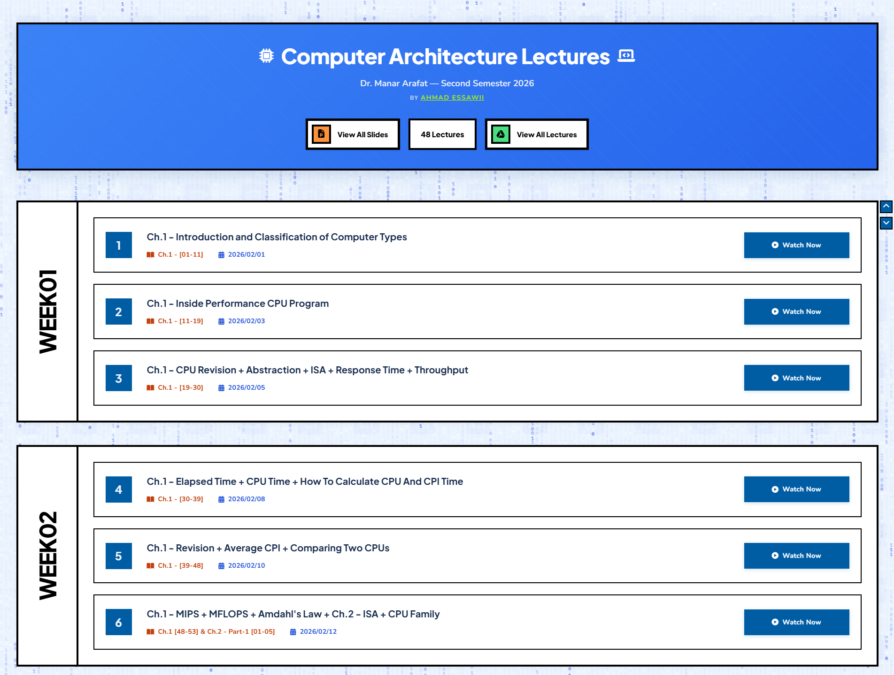

<div align="center">

# 🖥️ Computer Architecture Lectures

**All lectures, slides, and recordings organized by week, in one clean place.**

👩‍🏫 Dr. Manar Arafat &nbsp;•&nbsp; 📅 Second Semester 2026


### [🚀 Live Demo](https://ahmadessawii06.github.io/Computer-Architecture-Manar-Lectures/)



</div>

---

## ✨ Features

- 📚 **Weekly layout:** lectures grouped by week and loaded from a single JSON file
- ▶️ **Watch Now:** a direct recording link for every lecture
- 📂 **Quick access:** one click to all slides and all recordings on Google Drive
- 🌸 **Holiday cards:** days with no lecture are highlighted in orange
- 💻 **Binary rain:** an animated background that fits the course theme
- 📱 **Responsive:** works on desktop and mobile, with a scroll-to-top button

## 🛠️ Tech Stack

Pure **HTML**, **CSS**, and **vanilla JavaScript**. No frameworks and no build step.

## 📁 Project Structure

```
├── index.html
├── styles/style.css
├── scripts/script.js
├── data/data.json
└── assets/demo.png
```

## ⚡ Run Locally

```bash
git clone https://github.com/ahmadessawii06/Computer-Architecture-Manar-Lectures.git
cd Computer-Architecture-Manar-Lectures
```

Then open `index.html` in your browser, or use a local server such as the VS Code **Live Server** extension.

## 📝 Adding or Editing Lectures

Edit `data/data.json`. Each lecture follows this format:

```json
{
  "lecture_number": 1,
  "title": "Ch.1 - Introduction",
  "slides_numbers": "Ch.1 - [01-11]",
  "date": "2026/02/01",
  "link": "https://..."
}
```

> 💡 A title containing `No Lecture` or `Holiday` is automatically shown as a holiday card.

## 👨‍💻 Author

Made with ❤️ by [**Ahmad Essawii**](https://github.com/ahmadessawii06)

</div>
